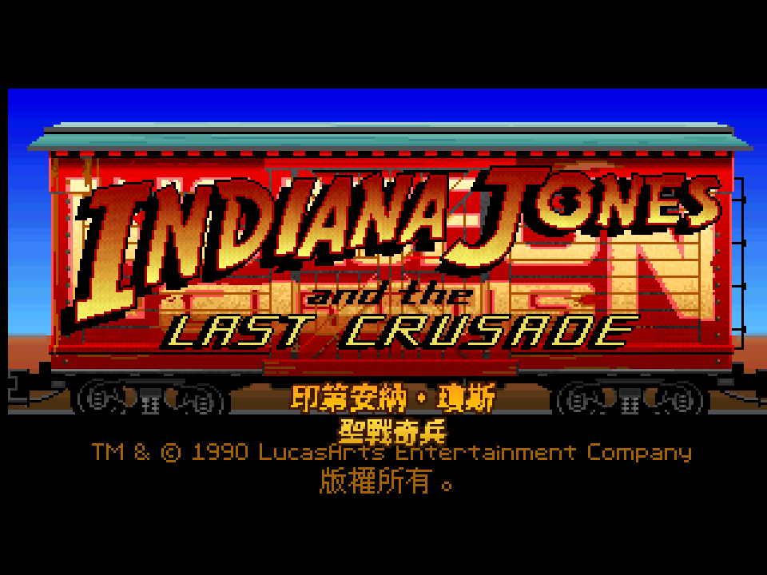
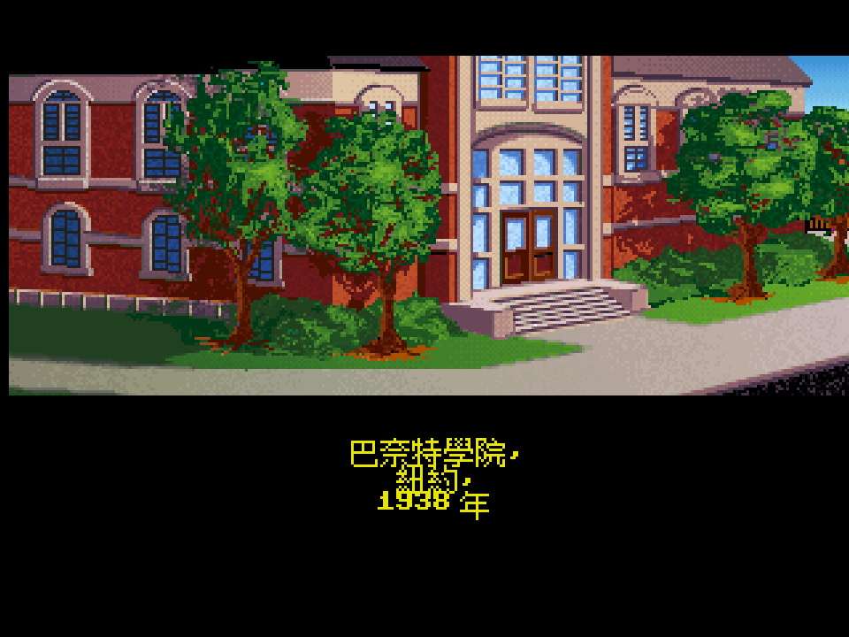
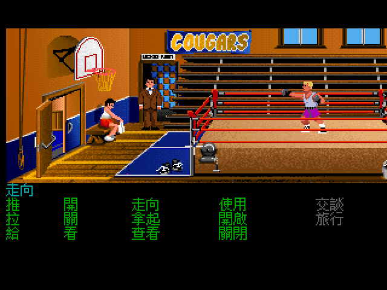
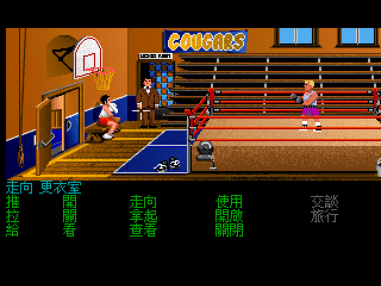
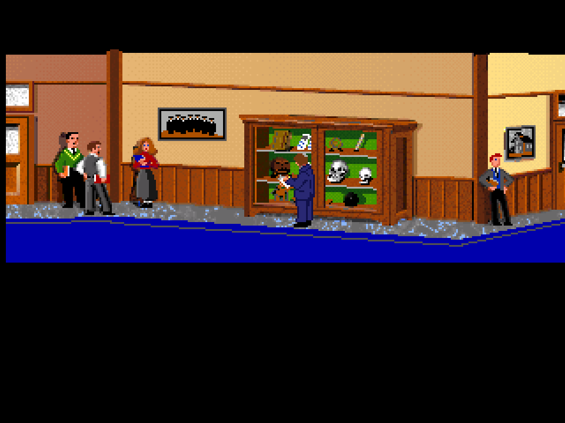

# 印第安納·瓊斯:最後聖戰 — 繁體中文化

> *Indiana Jones and the Last Crusade*(LucasFilm Games, 1989 · FM-Towns CD 版)的繁體中文化。
> 不改原版一個 byte,改 ScummVM:在繪字處攔下英文、查表、用點陣中文重畫——
> 再給遊戲裡每個說話的角色,配上一條對得上他長相的中文聲線。

---

還記得嗎?1989 年,電影《聖戰奇兵》在戲院放映的那個夏天,LucasFilm 把它做成了遊戲。我們在 14 吋 CRT 前面,看著那節火車車廂從右邊滑進來,招牌上 **INDIANA JONES** 的字一個一個亮起來——然後是一整套點下去就有反應的動詞:Walk to、Look at、Talk to。那是大多數人第一次知道,原來電影可以「玩」。

它從來沒有官方中文版。那時候沒有 GameFAQ、沒有 Discord,卡關了只能翻《電腦玩家》《軟體世界》那幾頁手冊翻譯,連聖杯騎士最後那三道試煉的提示,都是靠雜誌跟同學間口耳相傳。

這個 repo,是寫給三十年後那個同代玩家的一封信。你可以三層讀:想直接玩,跳到 [怎麼拿來玩](#play);想知道我們動了什麼,順著往下看;想看技術細節,翻到最後的 [怎麼做出來的](#tech)。

## 它說起了中文

它先是原封不動地開起來。那節車廂滑過,招牌亮起,連最底下那行版權聲明都跟著說起了中文:

> *TM & © 1990 LucasArts Entertainment Company* **版權所有。**

畫面一切,紅磚樓房浮上來,場景字幕從畫面中央亮出——這是冒險遊戲交代時空的老手法,而這一次,它用的是中文:

> **巴奈特學院,紐約,1938 年。**

接著是最熟悉的那一幕。原版底部那排英文動詞,全部換成了中文。FM-Towns 版的動詞比 DOS 版多,排得密,十四個動詞照樣一個不漏地塞進去、對齊、置中:

> 走向 · 推 · 拉 · 給 / 開 · 關 · 看 / 拿起 · 查看 / 使用 · 開啟 · 關閉 / 交談 · 旅行。

最容易出包的是中間那條青色**句子列**——你把游標移到哪、它就拼出「動詞 + 物件」。中文筆畫多,12 像素的字擠在房間畫面和面板的接縫上,差一點就被那道交界削掉頭。現在它穩穩落在縫上,一個筆畫都不缺:

> 把游標移到更衣室門口,句子列就吐出一整行 **走向 更衣室**。

## 真正的狠角色,是聲音

字幕是這類專案的基本功。最後聖戰這一作真正下重本的地方,是**配音**。

這裡有個尷尬的前提:**原版根本沒有語音**。1989 年的遊戲,對白全是畫面上的字。所以我們不是「把英文配音換成中文」——是**無中生有**,從零給它配一整套中文語音。而且不肯用一個旁白從頭唸到尾,要的是**每個角色一條對得上他長相的聲線**:老爸是老爸的聲音,反派是反派的聲音。

問題立刻來了:整套遊戲 1715 句對白,**怎麼知道哪一句是誰說的**?

最笨的辦法是真的去玩一輪,一句一句用耳朵認。我們沒有。我們**把遊戲反組譯了**。

SCUMM 的腳本 bytecode 裡,每一句要角色開口的台詞,前面都寫著一個指令:`print(N, "……")`——`N` 就是說話那個演員的編號;`printEgo` 則是印第本人。所以「誰說哪句」這件事,根本不在玩家的耳朵裡,而是**白紙黑字寫在資料檔裡**。我們用 `scummrp` 把 LFL 拆成腳本區塊,用自編的 `descumm` 反組譯,一條 `print(N, …)` 就對應出一句台詞的講者。1121 個講者標記,跟配音清單一比對,**對上了 99.7%**——零玩遊戲,全靜態。

對出來的卡司,各配一條 edge-tts 聲線,照著角色在電影/遊戲裡的長相挑:

| 角色 | 在遊戲裡是誰 | 招牌台詞(辨識證據) | 中文聲線 |
|---|---|---|---|
| **印第安納·瓊斯** | 呢帽皮夾克的主角 | 全場 710 句的吐槽 | 馬蓋先腔(俐落、帶痞) |
| **亨利·瓊斯**(老爸) | 白鬍學究、龜毛 | 「**記住我的日記!那三道試煉!**」 | 老成、慢、深 |
| **艾爾莎·施奈德** | 優雅金髮的奧地利女子 | 「**我是艾爾莎·施奈德博士**」 | 成熟女聲 |
| **馬可斯·布洛迪** | 禿頂老紳士、容易迷路 | 「**各位,跟我來,我認得路!**」 | 溫厚、迷糊 |
| **唐納文 / 城堡軍官** | 油頭、表面迷人的反派 | 「**元首見了一定大為高興!**」 | 港音洋派、奸滑 |
| **拳擊教練** | 開場健身房那位 | 「**要我怎麼陪你練拳?**」 | 爽朗有勁 |
| **聖杯騎士** | 七百歲、殘破盔甲 | 「**以騎士來說,你這身打扮真奇怪**」 | 極慢極沉、古老 |

守衛、士兵、學生這些雜魚,走另一條路:統一一條沉穩的底聲,再按演員編號各自微調音高,讓他們彼此聽得出不同、又都像 1940 年代會講話的人。按 **F9** 隨時在中文配音與英文配音之間切換。

從巴奈特學院的走廊開始,這套漢化一路鋪過威尼斯的地下墓穴、布倫瓦德城堡、零式飛艇、聖杯神廟:

> 玩家走得到的每一句對白都翻完了,連隨手「看」一眼場景物件的吐槽都是中文。

## 怎麼拿來玩

三平台都打包成「開箱即玩」的單一封裝,引擎、中文遊戲資料、字型、全套中文語音都在裡面:

| 平台 | 產物 | 怎麼跑 |
|---|---|---|
| **Linux** | `IndyCrusade-CHT-FULL-x86_64.AppImage` | 加執行權限後雙擊 |
| **Windows** | `IndyCrusade-CHT-win64-full.zip`(exe + 3 個 runtime DLL) | 解壓 → 雙擊 `play.bat` |
| **macOS** | `IndyCrusade-CHT-mac-full.tar.gz`(universal,Intel + Apple Silicon) | 解壓 → 右鍵打開 `.app` |

> ⚠️ 內含原版遊戲版權資料與中文配音的 full 封裝**僅供個人保存**,不公開散布;本 repo 只放工具、patch、翻譯表與文件。

## 怎麼做出來的

冷靜的那一段。整套手法的前提是**不碰原版資料**,所有中文化都在 ScummVM 引擎側完成。

**字幕**:`scummtr -g indy3towns` 把 LFL 裡的字串抽出 → 翻譯 → `encode-gbk.py`(UTF-8 → GBK + CRLF,`\134` 跳脫 0x5C 尾位元組)→ `scummtr` 匯回 LFL。匯入時踩過 GBK 尾位元組 `0xFE` 被當成函式長度的雷,改了 `scummtr` 的 `_checkRsc` 做 CJK-aware 判斷(見 `patches/scummtr-cjk-checkrsc.patch`)。

**繪字**:中文走 `chinese_gb16x12.fnt`(12×12 GBK 點陣,沿用同類前例 `zak-cht`)。關鍵前例不是姊妹作亞特蘭提斯(那是 SCUMM v5 talkie),而是**同屬 SCUMM v3 + FM-Towns** 的 Zak McKracken 繁中化:`CharsetRendererV3` + `TownsV3` 中文路徑 + `chinese_gb16x12`。本作主要的引擎改動 = 把該路徑的 `GID_ZAK` 條件擴到 `GID_INDY3`,並把字數從 GB2312 的 8178 放到全 GBK 的 23940(`patches/scumm-cht-indy3.patch`)。

**配音**:
1. `scummrp -g indy3towns -o` 把 LFL 拆成腳本區塊。
2. 自編 `descumm`(`scripts/build_descumm.sh`,scummvm-tools)`-3 -n` 反組譯。
3. `tools/extract_speakers.py` 解析 `print(N,Text)` / `printEgo` → 每句台詞講者 → cht_key(FNV-1a over GBK pairs,逐位元組對齊引擎)。
4. `tools/dub_cast.py` + `dub_cast_worker.py` 套卡司((actor, room) 特例如「聖杯騎士 = 演員 10 在房間 86」優先於演員預設)→ edge-tts dub 進 `voice/a<actor>/`。
5. 引擎側 `Sound::playChtVoice`(`patches/scumm-cht-indy3.patch`)在繪字時用 (演員, key) 查 `voice/a<actor>/`(專屬)→ `voice/npc/`(雜魚 + 按演員變調)→ `voice/`(印第通用);`ChtRateShiftStream` 做 per-actor 音高微調。

**三平台打包**:Linux `scripts/package_appimage.sh`;Windows `scripts/build_windows_docker.sh`(docker mingw 自編 SDL2/zlib 靜態連結)+ `package_windows.sh`;macOS `.github/workflows/build-macos.yml`(`macos-14` arm64 + `macos-15-intel` x86_64 + `lipo` 合 universal)+ `package_macos_local.sh`。三平台都 pin 同一個 ScummVM base commit,確保 patch 套得上。

## 信仰之躍

遊戲的最後,唐納文一槍打穿了亨利·瓊斯的胸口。父親倒在地上,唯一救得了他的,是聖杯——而聖杯,在三道致命試煉的另一端。

最後一關叫「神之路」。印第站在獅頭石像前,腳下是看不見底的萬丈深淵,對岸遙不可及,中間什麼都沒有。聖杯日記上只寫著一句:

> *Only in the leap from the lion's head will he prove his worth.*
> **唯有自獅頭縱身一躍,方證其價值。**

他低頭看著那道過不去的鴻溝,喃喃自語:「這是……信仰之躍。」身後,氣若游絲的老爸用盡力氣擠出一句:

> *You must believe, boy. You must… believe.*
> **你必須相信,孩子。你必須……相信。**

於是他閉上眼,把一隻腳踏進了虛空——

橋,一直都在那裡。只是你得先跨出去,才看得見。

把一款三十七年沒人做過中文版的老遊戲,從零生出一整套語音、把每個角色的聲音一句一句從反組譯的程式碼裡挖出來——某種程度上,這也是一次信仰之躍。動手之前,你並不知道腳下到底有沒有橋。

現在,它在那裡了。

## 致謝

- **ScummVM** 團隊——讓三十年前的引擎活到今天,還能被攔下來講中文。
- **scummtr / scummrp / descumm**(Thomas Combeleran 與 scummvm-tools)——抽字、拆資源、反組譯的工具鏈。
- 1990 年代《電腦玩家》《軟體世界》《PC Game》三大誌的手冊翻譯與攻略——當年沒有中文版時,我們的聖杯日記。

姊妹作:[印第安納·瓊斯:亞特蘭提斯之謎 繁中化](https://github.com/wicanr2/indiana-jones-and-the-fate-of-atlantis-cht)。
